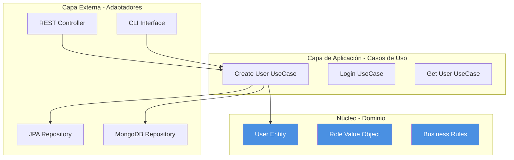
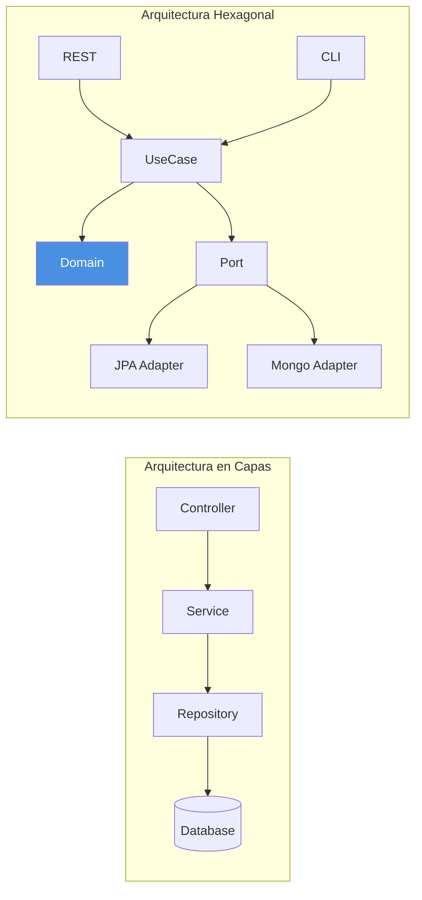

# Arquitectura Hexagonal: La Base de Microservicios Mantenibles

> **Serie: Construyendo Microservicios con Spring Boot y Arquitectura Hexagonal**  
> Parte 1 de 7 - Introducción a la Arquitectura Hexagonal


## 📖 Introducción

En el desarrollo de software moderno, la mantenibilidad y la testabilidad son tan importantes como la funcionalidad. La **Arquitectura Hexagonal** (también conocida como **Puertos y Adaptadores**) es un patrón arquitectónico que nos ayuda a construir aplicaciones desacopladas, fáciles de probar y mantener.

En esta serie de artículos, construiremos un sistema completo de microservicios usando Spring Boot 3, Java 21, y arquitectura hexagonal. Este primer artículo sienta las bases conceptuales que aplicaremos en los siguientes.

## 🎯 ¿Qué es la Arquitectura Hexagonal?

La Arquitectura Hexagonal fue propuesta por **Alistair Cockburn** en 2005. Su objetivo principal es **aislar la lógica de negocio** de los detalles técnicos de implementación (bases de datos, frameworks, APIs externas, etc.).

### El Problema que Resuelve

En arquitecturas tradicionales, es común ver código como este:

```java
// ❌ Mal ejemplo: Lógica de negocio acoplada a detalles técnicos
@RestController
public class UserController {
    @Autowired
    private UserRepository repository; // Acoplamiento directo a JPA
    
    @PostMapping("/users")
    public User createUser(@RequestBody User user) {
        // Validación mezclada con persistencia
        if (user.getEmail() == null) {
            throw new RuntimeException("Email required");
        }
        // Lógica de negocio en el controlador
        user.setPassword(BCrypt.hashpw(user.getPassword()));
        return repository.save(user); // Retornando entidad JPA directamente
    }
}
```

**Problemas de este enfoque:**
- ✗ Lógica de negocio dispersa entre controladores y repositorios
- ✗ Difícil de testear sin levantar Spring Context
- ✗ Cambiar de JPA a MongoDB requiere modificar múltiples capas
- ✗ Imposible usar la lógica desde otro punto de entrada (CLI, eventos, etc.)

### La Solución: Separación por Responsabilidades

La arquitectura hexagonal propone organizar el código en **tres capas concéntricas**:



## 🏛️ Las Tres Capas

### 1. **Dominio (Núcleo)** - El Corazón del Sistema

Esta es la capa más importante. Contiene:
- **Entidades**: Objetos con identidad (User, Product, Order)
- **Value Objects**: Objetos sin identidad (Email, Money, Address)
- **Reglas de Negocio**: Validaciones y lógica pura

```java
// ✅ Dominio puro - Sin dependencias de frameworks
package com.example.domain.model;

public class User {
    private Long id;
    private String username;
    private String email;
    private String password;
    private Set<Role> roles;
    private boolean enabled;
    
    // Regla de negocio en el dominio
    public void activate() {
        if (this.email == null || this.email.isEmpty()) {
            throw new DomainException("Cannot activate user without email");
        }
        this.enabled = true;
    }
    
    // Validación de negocio
    public boolean canAccessResource(String permission) {
        return roles.stream()
            .flatMap(role -> role.getPermissions().stream())
            .anyMatch(p -> p.equals(permission));
    }
}
```

**Características clave:**
- ✅ Sin anotaciones de Spring, JPA, o cualquier framework
- ✅ Código Java puro que se puede testear sin dependencias
- ✅ Expresa el lenguaje del negocio (Domain-Driven Design)

### 2. **Aplicación (Casos de Uso)** - Orquestación

Esta capa coordina el flujo de datos entre el dominio y el mundo exterior:

```java
// ✅ Caso de uso - Orquesta el dominio
package com.example.application.service;

@Service
@RequiredArgsConstructor
public class AuthService implements AuthUseCase {
    
    private final UserPort userPort; // Puerto (interfaz)
    private final PasswordEncoder passwordEncoder; // Servicio de infraestructura
    private final JwtTokenProvider tokenProvider;
    
    @Override
    @Transactional
    public User register(User user, String rawPassword) {
        // 1. Validar reglas de negocio
        if (userPort.existsByUsername(user.getUsername())) {
            throw new UserAlreadyExistsException(user.getUsername());
        }
        
        // 2. Aplicar transformaciones
        user.setPassword(passwordEncoder.encode(rawPassword));
        user.activate();
        
        // 3. Persistir usando el puerto
        return userPort.save(user);
    }
}
```

**Características clave:**
- ✅ Define **interfaces (puertos)** para comunicarse con el exterior
- ✅ Orquesta entidades del dominio
- ✅ No sabe nada sobre HTTP, bases de datos, o frameworks específicos

### 3. **Infraestructura (Adaptadores)** - Detalles Técnicos

Esta capa implementa los puertos definidos en la capa de aplicación:

```java
// ✅ Adaptador de salida - Implementa el puerto
package com.example.infrastructure.adapter.persistence;

@Repository
@RequiredArgsConstructor
public class UserJpaAdapter implements UserPort {
    
    private final UserJpaRepository jpaRepository;
    private final UserMapper mapper;
    
    @Override
    public User save(User user) {
        UserEntity entity = mapper.toEntity(user);
        UserEntity saved = jpaRepository.save(entity);
        return mapper.toDomain(saved);
    }
    
    @Override
    public Optional<User> findByUsername(String username) {
        return jpaRepository.findByUsername(username)
            .map(mapper::toDomain);
    }
}
```

```java
// ✅ Adaptador de entrada - REST Controller
package com.example.adapter.rest;

@RestController
@RequestMapping("/api/auth")
@RequiredArgsConstructor
public class AuthController {
    
    private final AuthUseCase authUseCase; // Usa el puerto
    private final UserMapper mapper;
    
    @PostMapping("/register")
    public ResponseEntity<ApiResponse<UserDTO>> register(
            @Valid @RequestBody RegisterRequest request) {
        
        User user = mapper.toDomain(request);
        User registered = authUseCase.register(user, request.getPassword());
        
        return ResponseEntity.ok(
            ApiResponse.success(mapper.toDTO(registered))
        );
    }
}
```

## 🔌 Puertos y Adaptadores

### Puertos (Interfaces)

Los **puertos** son interfaces que definen contratos:

```java
// Puerto de salida - Define qué necesita el dominio
package com.example.domain.port.out;

public interface UserPort {
    User save(User user);
    Optional<User> findByUsername(String username);
    Optional<User> findByEmail(String email);
    boolean existsByUsername(String username);
}
```

```java
// Puerto de entrada - Define casos de uso
package com.example.domain.port.in;

public interface AuthUseCase {
    User register(User user, String rawPassword);
    String login(String username, String password);
    User getCurrentUser();
}
```

### Adaptadores (Implementaciones)

Los **adaptadores** implementan los puertos:

**Adaptadores de Entrada** (Driving Adapters):
- REST Controllers
- GraphQL Resolvers
- CLI Commands
- Message Consumers (Kafka, RabbitMQ)

**Adaptadores de Salida** (Driven Adapters):
- JPA Repositories
- MongoDB Repositories
- HTTP Clients
- Message Producers

## 📊 Comparación: Arquitectura Tradicional vs Hexagonal

| Aspecto | Arquitectura en Capas | Arquitectura Hexagonal |
|---------|----------------------|------------------------|
| **Dependencias** | Capas superiores dependen de inferiores | Todo depende del dominio |
| **Testabilidad** | Requiere mocks de infraestructura | Dominio testeable sin mocks |
| **Cambio de DB** | Afecta múltiples capas | Solo cambia el adaptador |
| **Lógica de negocio** | Dispersa en capas | Centralizada en dominio |
| **Frameworks** | Acoplamiento fuerte | Acoplamiento débil |
| **Reutilización** | Difícil | Fácil (múltiples adaptadores) |

### Ejemplo Visual



## ✅ Ventajas de la Arquitectura Hexagonal

### 1. **Testabilidad Superior**

```java
// Test del dominio - Sin dependencias
@Test
void shouldActivateUserWithValidEmail() {
    User user = new User("john", "john@example.com", "pass123");
    
    user.activate();
    
    assertTrue(user.isEnabled());
}

// Test del caso de uso - Con mocks simples
@Test
void shouldRegisterNewUser() {
    UserPort mockPort = mock(UserPort.class);
    when(mockPort.existsByUsername("john")).thenReturn(false);
    
    AuthService service = new AuthService(mockPort, passwordEncoder, tokenProvider);
    User user = service.register(new User("john", "john@example.com"), "pass123");
    
    verify(mockPort).save(any(User.class));
}
```

### 2. **Flexibilidad de Implementación**

Puedes cambiar de PostgreSQL a MongoDB sin tocar la lógica de negocio:

```java
// Mismo puerto, diferentes adaptadores
public interface UserPort {
    User save(User user);
}

// Adaptador JPA
@Repository
class UserJpaAdapter implements UserPort { ... }

// Adaptador MongoDB
@Repository
class UserMongoAdapter implements UserPort { ... }
```

### 3. **Múltiples Puntos de Entrada**

La misma lógica puede ser usada desde:
- REST API
- GraphQL
- CLI
- Eventos (Kafka)
- Scheduled Jobs

### 4. **Independencia de Frameworks**

Tu lógica de negocio no depende de Spring, Hibernate, o cualquier framework:

```java
// ✅ Dominio puro - Sobrevivirá a cualquier framework
public class User {
    public void changePassword(String oldPassword, String newPassword) {
        if (!this.password.equals(oldPassword)) {
            throw new InvalidPasswordException();
        }
        this.password = newPassword;
    }
}
```

## 🎯 Cuándo Usar Arquitectura Hexagonal

### ✅ Casos Ideales:

- **Proyectos de larga duración** que evolucionarán
- **Lógica de negocio compleja** que requiere testeo exhaustivo
- **Múltiples interfaces** (REST, CLI, eventos)
- **Equipos grandes** que necesitan separación clara
- **Microservicios** que deben ser independientes

### ⚠️ Casos donde Puede Ser Excesivo:

- Prototipos rápidos o MVPs
- CRUD simples sin lógica de negocio
- Proyectos muy pequeños (< 1000 líneas)
- Equipos sin experiencia en DDD

## 🗺️ Estructura de Directorios

Así organizaremos nuestro proyecto:

```
auth-service/
├── domain/                    # Núcleo del negocio
│   ├── model/                # Entidades y Value Objects
│   │   ├── User.java
│   │   └── Role.java
│   ├── exception/            # Excepciones de dominio
│   │   └── UserAlreadyExistsException.java
│   └── port/                 # Interfaces (contratos)
│       ├── in/              # Casos de uso
│       │   └── AuthUseCase.java
│       └── out/             # Repositorios
│           └── UserPort.java
│
├── application/              # Orquestación
│   ├── service/             # Implementación de casos de uso
│   │   └── AuthService.java
│   ├── dto/                 # DTOs de aplicación
│   │   └── UserDTO.java
│   └── mapper/              # Mappers (MapStruct)
│       └── UserMapper.java
│
├── infrastructure/           # Detalles técnicos
│   ├── adapter/
│   │   ├── persistence/     # Adaptadores de BD
│   │   │   ├── UserJpaAdapter.java
│   │   │   └── entity/
│   │   │       └── UserEntity.java
│   │   └── security/        # Configuración de seguridad
│   │       ├── JwtTokenProvider.java
│   │       └── SecurityConfig.java
│   └── config/              # Configuración de Spring
│       └── BeanConfiguration.java
│
└── adapter/                  # Puntos de entrada
    └── rest/                # Controladores REST
        └── AuthController.java
```

## 🔑 Principios Clave a Recordar

> [!IMPORTANT]
> **Regla de Oro**: Las dependencias siempre apuntan hacia el dominio, nunca al revés.

1. **El dominio no conoce la infraestructura**
   - No importa Spring, JPA, o HTTP en el dominio
   
2. **Los puertos son interfaces, no clases**
   - Define contratos, no implementaciones
   
3. **Los adaptadores son intercambiables**
   - Puedes tener múltiples implementaciones del mismo puerto
   
4. **La lógica de negocio vive en el dominio**
   - No en controladores, no en repositorios

## 📚 Próximo Artículo

En el **Parte 2: Setup del Proyecto Multi-Módulo**, veremos:
- Configuración de Maven multi-módulo
- Estructura del proyecto con `common`, `auth-service`, y `product-service`
- Docker Compose para PostgreSQL y MongoDB
- Configuración de Spring Boot 3 y Java 21

## 🔗 Referencias

- [Hexagonal Architecture - Alistair Cockburn](https://alistair.cockburn.us/hexagonal-architecture/)
- [Domain-Driven Design - Eric Evans](https://www.domainlanguage.com/ddd/)
- [Clean Architecture - Robert C. Martin](https://blog.cleancoder.com/uncle-bob/2012/08/13/the-clean-architecture.html)

---

**¿Te gustó este artículo?** En la próxima parte construiremos la estructura completa del proyecto con Maven multi-módulo y Docker.

**Serie Completa:**
1. **Introducción a la Arquitectura Hexagonal** ← Estás aquí
2. Setup del Proyecto Multi-Módulo
3. Implementación del Auth Service
4. Implementación del Product Service
5. Seguridad con JWT y RSA
6. Patrones y Mejores Prácticas
7. Testing y Deployment
