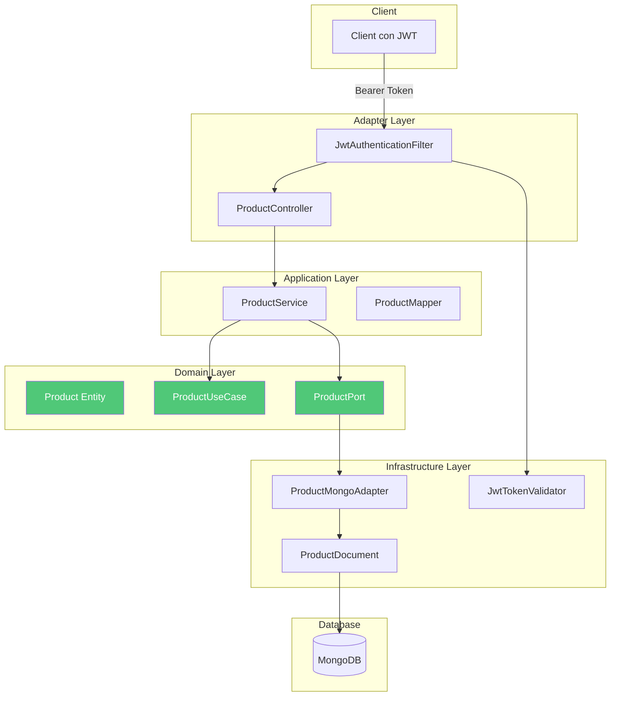

# Implementación del Product Service: MongoDB y Validación JWT

> **Serie: Construyendo Microservicios con Spring Boot y Arquitectura Hexagonal**  
> Parte 4 de 7 - Product Service con MongoDB

## 📖 Introducción

En este artículo implementaremos el **product-service**, nuestro segundo microservicio que gestiona el catálogo de productos. A diferencia del auth-service, este servicio:

- 📦 Usa **MongoDB** como base de datos NoSQL
- 🔐 **Valida** JWT pero no los genera
- ✅ Implementa **autorización basada en permisos**
- 🏗️ Sigue la misma arquitectura hexagonal

## 🏗️ Arquitectura del Product Service



## 📦 Paso 1: Capa de Dominio

### 1.1 Category Enum

```java
package com.example.microservices.product.domain.enums;

/**
 * Categorías de productos
 */
public enum Category {
    ELECTRONICS,
    CLOTHING,
    BOOKS,
    HOME,
    SPORTS,
    TOYS,
    FOOD,
    OTHER
}
```

### 1.2 Product Entity - Modelo de Dominio

```java
package com.example.microservices.product.domain.model;

import com.example.microservices.product.domain.enums.Category;
import lombok.AllArgsConstructor;
import lombok.Data;
import lombok.NoArgsConstructor;

import java.math.BigDecimal;
import java.time.Instant;
import java.util.ArrayList;
import java.util.List;

/**
 * Entidad de dominio Product - Sin anotaciones de MongoDB
 */
@Data
@NoArgsConstructor
@AllArgsConstructor
public class Product {
    private String id;
    private String name;
    private String description;
    private BigDecimal price;
    private Category category;
    private Integer stock;
    private List<String> images;
    private List<Review> reviews;
    private Instant createdAt;
    private Instant updatedAt;

    /**
     * Constructor para creación
     */
    public Product(String name, String description, BigDecimal price, 
                   Category category, Integer stock) {
        this.name = name;
        this.description = description;
        this.price = price;
        this.category = category;
        this.stock = stock;
        this.images = new ArrayList<>();
        this.reviews = new ArrayList<>();
        this.createdAt = Instant.now();
    }

    /**
     * Regla de negocio: Verificar disponibilidad
     */
    public boolean isAvailable() {
        return stock != null && stock > 0;
    }

    /**
     * Regla de negocio: Reducir stock
     */
    public void reduceStock(int quantity) {
        if (!isAvailable() || stock < quantity) {
            throw new IllegalStateException(
                "Insufficient stock for product: " + name
            );
        }
        this.stock -= quantity;
        this.updatedAt = Instant.now();
    }

    /**
     * Regla de negocio: Agregar review
     */
    public void addReview(Review review) {
        if (this.reviews == null) {
            this.reviews = new ArrayList<>();
        }
        this.reviews.add(review);
        this.updatedAt = Instant.now();
    }

    /**
     * Calcular rating promedio
     */
    public Double getAverageRating() {
        if (reviews == null || reviews.isEmpty()) {
            return 0.0;
        }
        return reviews.stream()
                .mapToInt(Review::getRating)
                .average()
                .orElse(0.0);
    }

    @Data
    @NoArgsConstructor
    @AllArgsConstructor
    public static class Review {
        private String userId;
        private String comment;
        private Integer rating; // 1-5
        private Instant createdAt;
    }
}
```

### 1.3 Puertos

#### Puerto de Entrada

```java
package com.example.microservices.product.domain.port.in;

import com.example.microservices.product.domain.model.Product;

import java.util.List;

/**
 * Puerto de entrada - Casos de uso de productos
 */
public interface ProductUseCase {
    Product create(Product product);
    Product update(String id, Product product);
    Product findById(String id);
    List<Product> findAll();
    void deleteById(String id);
    List<Product> findByCategory(String category);
}
```

#### Puerto de Salida

```java
package com.example.microservices.product.domain.port.out;

import com.example.microservices.product.domain.enums.Category;
import com.example.microservices.product.domain.model.Product;

import java.util.List;
import java.util.Optional;

/**
 * Puerto de salida - Persistencia de productos
 */
public interface ProductPort {
    Product save(Product product);
    Optional<Product> findById(String id);
    List<Product> findAll();
    List<Product> findByCategory(Category category);
    void deleteById(String id);
    boolean existsById(String id);
}
```

### 1.4 Excepciones de Dominio

```java
package com.example.microservices.product.domain.exception;

public class ProductNotFoundException extends RuntimeException {
    public ProductNotFoundException(String id) {
        super("Product not found with id: " + id);
    }
}
```

```java
package com.example.microservices.product.domain.exception;

public class InsufficientStockException extends RuntimeException {
    public InsufficientStockException(String productName, int requested, int available) {
        super(String.format(
            "Insufficient stock for product '%s'. Requested: %d, Available: %d",
            productName, requested, available
        ));
    }
}
```

## 🎯 Paso 2: Capa de Aplicación

### 2.1 DTOs

```java
package com.example.microservices.product.application.dto;

import com.example.microservices.product.domain.enums.Category;
import jakarta.validation.constraints.*;

import java.math.BigDecimal;
import java.util.List;

/**
 * DTO para crear producto
 */
public record CreateProductRequest(
    @NotBlank(message = "Name is required")
    @Size(min = 3, max = 100)
    String name,

    @Size(max = 500)
    String description,

    @NotNull(message = "Price is required")
    @DecimalMin(value = "0.01", message = "Price must be greater than 0")
    BigDecimal price,

    @NotNull(message = "Category is required")
    Category category,

    @NotNull(message = "Stock is required")
    @Min(value = 0, message = "Stock cannot be negative")
    Integer stock,

    List<String> images
) {}
```

```java
package com.example.microservices.product.application.dto;

import java.math.BigDecimal;

/**
 * DTO para actualizar producto
 */
public record UpdateProductRequest(
    String name,
    String description,
    BigDecimal price,
    Integer stock,
    List<String> images
) {}
```

```java
package com.example.microservices.product.application.dto;

import com.example.microservices.product.domain.enums.Category;

import java.math.BigDecimal;
import java.time.Instant;
import java.util.List;

/**
 * DTO de respuesta de producto
 */
public record ProductDTO(
    String id,
    String name,
    String description,
    BigDecimal price,
    Category category,
    Integer stock,
    List<String> images,
    Double averageRating,
    Integer reviewCount,
    Instant createdAt,
    Instant updatedAt
) {}
```

### 2.2 Mapper con MapStruct

```java
package com.example.microservices.product.application.mapper;

import com.example.microservices.product.application.dto.CreateProductRequest;
import com.example.microservices.product.application.dto.ProductDTO;
import com.example.microservices.product.application.dto.UpdateProductRequest;
import com.example.microservices.product.domain.model.Product;
import org.mapstruct.*;

/**
 * Mapper entre Product (dominio) y DTOs
 */
@Mapper(componentModel = "spring")
public interface ProductMapper {

    @Mapping(target = "averageRating", expression = "java(product.getAverageRating())")
    @Mapping(target = "reviewCount", expression = "java(product.getReviews() != null ? product.getReviews().size() : 0)")
    ProductDTO toDTO(Product product);

    @Mapping(target = "id", ignore = true)
    @Mapping(target = "reviews", ignore = true)
    @Mapping(target = "createdAt", ignore = true)
    @Mapping(target = "updatedAt", ignore = true)
    Product toDomain(CreateProductRequest request);

    @BeanMapping(nullValuePropertyMappingStrategy = NullValuePropertyMappingStrategy.IGNORE)
    @Mapping(target = "id", ignore = true)
    @Mapping(target = "category", ignore = true)
    @Mapping(target = "reviews", ignore = true)
    @Mapping(target = "createdAt", ignore = true)
    @Mapping(target = "updatedAt", ignore = true)
    void updateProductFromDto(UpdateProductRequest dto, @MappingTarget Product product);
}
```

### 2.3 ProductService - Implementación del Caso de Uso

```java
package com.example.microservices.product.application.service;

import com.example.microservices.product.domain.enums.Category;
import com.example.microservices.product.domain.exception.ProductNotFoundException;
import com.example.microservices.product.domain.model.Product;
import com.example.microservices.product.domain.port.in.ProductUseCase;
import com.example.microservices.product.domain.port.out.ProductPort;
import lombok.RequiredArgsConstructor;
import lombok.extern.slf4j.Slf4j;
import org.springframework.stereotype.Service;

import java.time.Instant;
import java.util.List;

/**
 * Implementación de casos de uso de productos
 */
@Slf4j
@Service
@RequiredArgsConstructor
public class ProductService implements ProductUseCase {

    private final ProductPort productPort;

    @Override
    public Product create(Product product) {
        log.info("Creating product: {}", product.getName());
        product.setCreatedAt(Instant.now());
        product.setUpdatedAt(Instant.now());
        return productPort.save(product);
    }

    @Override
    public Product update(String id, Product product) {
        log.info("Updating product: {}", id);
        
        Product existing = productPort.findById(id)
                .orElseThrow(() -> new ProductNotFoundException(id));

        // Actualizar solo campos no nulos
        if (product.getName() != null) existing.setName(product.getName());
        if (product.getDescription() != null) existing.setDescription(product.getDescription());
        if (product.getPrice() != null) existing.setPrice(product.getPrice());
        if (product.getStock() != null) existing.setStock(product.getStock());
        if (product.getImages() != null) existing.setImages(product.getImages());
        
        existing.setUpdatedAt(Instant.now());
        
        return productPort.save(existing);
    }

    @Override
    public Product findById(String id) {
        log.debug("Finding product by id: {}", id);
        return productPort.findById(id)
                .orElseThrow(() -> new ProductNotFoundException(id));
    }

    @Override
    public List<Product> findAll() {
        log.debug("Finding all products");
        return productPort.findAll();
    }

    @Override
    public void deleteById(String id) {
        log.info("Deleting product: {}", id);
        if (!productPort.existsById(id)) {
            throw new ProductNotFoundException(id);
        }
        productPort.deleteById(id);
    }

    @Override
    public List<Product> findByCategory(String category) {
        log.debug("Finding products by category: {}", category);
        Category cat = Category.valueOf(category.toUpperCase());
        return productPort.findByCategory(cat);
    }
}
```

## 🔧 Paso 3: Capa de Infraestructura

### 3.1 Documento MongoDB

```java
package com.example.microservices.product.infrastructure.adapter.persistence.document;

import com.example.microservices.product.domain.enums.Category;
import lombok.AllArgsConstructor;
import lombok.Data;
import lombok.NoArgsConstructor;
import org.springframework.data.annotation.Id;
import org.springframework.data.mongodb.core.mapping.Document;

import java.math.BigDecimal;
import java.time.Instant;
import java.util.List;

/**
 * Documento MongoDB para productos
 */
@Document(collection = "products")
@Data
@NoArgsConstructor
@AllArgsConstructor
public class ProductDocument {
    
    @Id
    private String id;
    private String name;
    private String description;
    private BigDecimal price;
    private Category category;
    private Integer stock;
    private List<String> images;
    private List<ReviewDocument> reviews;
    private Instant createdAt;
    private Instant updatedAt;

    @Data
    @NoArgsConstructor
    @AllArgsConstructor
    public static class ReviewDocument {
        private String userId;
        private String comment;
        private Integer rating;
        private Instant createdAt;
    }
}
```

### 3.2 MongoDB Repository

```java
package com.example.microservices.product.infrastructure.adapter.persistence;

import com.example.microservices.product.domain.enums.Category;
import com.example.microservices.product.infrastructure.adapter.persistence.document.ProductDocument;
import org.springframework.data.mongodb.repository.MongoRepository;
import org.springframework.stereotype.Repository;

import java.util.List;

@Repository
public interface ProductMongoRepository extends MongoRepository<ProductDocument, String> {
    List<ProductDocument> findByCategory(Category category);
}
```

### 3.3 Adaptador MongoDB - Implementa ProductPort

```java
package com.example.microservices.product.infrastructure.adapter.persistence;

import com.example.microservices.product.domain.enums.Category;
import com.example.microservices.product.domain.model.Product;
import com.example.microservices.product.domain.port.out.ProductPort;
import com.example.microservices.product.infrastructure.adapter.persistence.document.ProductDocument;
import com.example.microservices.product.infrastructure.adapter.persistence.mapper.ProductDocumentMapper;
import lombok.RequiredArgsConstructor;
import org.springframework.stereotype.Component;

import java.util.List;
import java.util.Optional;
import java.util.stream.Collectors;

/**
 * Adaptador que implementa ProductPort usando MongoDB
 */
@Component
@RequiredArgsConstructor
public class ProductMongoAdapter implements ProductPort {

    private final ProductMongoRepository mongoRepository;
    private final ProductDocumentMapper mapper;

    @Override
    public Product save(Product product) {
        ProductDocument document = mapper.toDocument(product);
        ProductDocument saved = mongoRepository.save(document);
        return mapper.toDomain(saved);
    }

    @Override
    public Optional<Product> findById(String id) {
        return mongoRepository.findById(id)
                .map(mapper::toDomain);
    }

    @Override
    public List<Product> findAll() {
        return mongoRepository.findAll().stream()
                .map(mapper::toDomain)
                .collect(Collectors.toList());
    }

    @Override
    public List<Product> findByCategory(Category category) {
        return mongoRepository.findByCategory(category).stream()
                .map(mapper::toDomain)
                .collect(Collectors.toList());
    }

    @Override
    public void deleteById(String id) {
        mongoRepository.deleteById(id);
    }

    @Override
    public boolean existsById(String id) {
        return mongoRepository.existsById(id);
    }
}
```

### 3.4 JWT Token Validator (Solo Validación)

```java
package com.example.microservices.product.infrastructure.adapter.security;

import com.example.microservices.common.security.RsaKeyUtils;
import io.jsonwebtoken.*;
import lombok.extern.slf4j.Slf4j;
import org.springframework.beans.factory.annotation.Value;
import org.springframework.core.io.Resource;
import org.springframework.stereotype.Component;

import java.security.PublicKey;
import java.util.Arrays;
import java.util.List;

/**
 * Validador de JWT - Solo valida, no genera tokens
 */
@Slf4j
@Component
public class JwtTokenValidator {

    @Value("classpath:${jwt.public-key-path}")
    private Resource publicKeyResource;

    private PublicKey publicKey;

    /**
     * Obtener username del token
     */
    public String getUsernameFromToken(String token) {
        try {
            if (publicKey == null) {
                loadPublicKey();
            }

            Claims claims = Jwts.parser()
                    .verifyWith(publicKey)
                    .build()
                    .parseSignedClaims(token)
                    .getPayload();

            return claims.getSubject();
        } catch (Exception e) {
            log.error("Error extracting username from token", e);
            return null;
        }
    }

    /**
     * Obtener roles del token
     */
    public List<String> getRolesFromToken(String token) {
        try {
            if (publicKey == null) {
                loadPublicKey();
            }

            Claims claims = Jwts.parser()
                    .verifyWith(publicKey)
                    .build()
                    .parseSignedClaims(token)
                    .getPayload();

            String rolesString = claims.get("roles", String.class);
            if (rolesString != null && !rolesString.isEmpty()) {
                return Arrays.asList(rolesString.split(","));
            }
            return List.of();
        } catch (Exception e) {
            log.error("Error extracting roles from token", e);
            return List.of();
        }
    }

    /**
     * Validar token JWT
     */
    public boolean validateToken(String token) {
        try {
            if (publicKey == null) {
                loadPublicKey();
            }

            Jwts.parser()
                    .verifyWith(publicKey)
                    .build()
                    .parseSignedClaims(token);

            return true;
        } catch (SecurityException ex) {
            log.error("Invalid JWT signature");
        } catch (MalformedJwtException ex) {
            log.error("Invalid JWT token");
        } catch (ExpiredJwtException ex) {
            log.error("Expired JWT token");
        } catch (UnsupportedJwtException ex) {
            log.error("Unsupported JWT token");
        } catch (IllegalArgumentException ex) {
            log.error("JWT claims string is empty");
        } catch (Exception ex) {
            log.error("JWT validation error", ex);
        }
        return false;
    }

    private void loadPublicKey() {
        this.publicKey = RsaKeyUtils.loadPublicKey(publicKeyResource);
        log.info("RSA public key loaded successfully");
    }
}
```

### 3.5 JWT Authentication Filter

```java
package com.example.microservices.product.infrastructure.adapter.security;

import jakarta.servlet.FilterChain;
import jakarta.servlet.ServletException;
import jakarta.servlet.http.HttpServletRequest;
import jakarta.servlet.http.HttpServletResponse;
import lombok.RequiredArgsConstructor;
import lombok.extern.slf4j.Slf4j;
import org.springframework.security.authentication.UsernamePasswordAuthenticationToken;
import org.springframework.security.core.authority.SimpleGrantedAuthority;
import org.springframework.security.core.context.SecurityContextHolder;
import org.springframework.security.web.authentication.WebAuthenticationDetailsSource;
import org.springframework.stereotype.Component;
import org.springframework.util.StringUtils;
import org.springframework.web.filter.OncePerRequestFilter;

import java.io.IOException;
import java.util.List;

/**
 * Filtro para validar JWT en cada request
 */
@Slf4j
@Component
@RequiredArgsConstructor
public class JwtAuthenticationFilter extends OncePerRequestFilter {

    private final JwtTokenValidator jwtTokenValidator;

    @Override
    protected void doFilterInternal(HttpServletRequest request,
            HttpServletResponse response,
            FilterChain filterChain) throws ServletException, IOException {
        try {
            String jwt = getJwtFromRequest(request);

            if (StringUtils.hasText(jwt) && jwtTokenValidator.validateToken(jwt)) {
                String username = jwtTokenValidator.getUsernameFromToken(jwt);
                List<String> roles = jwtTokenValidator.getRolesFromToken(jwt);

                // Convertir roles a authorities
                List<SimpleGrantedAuthority> authorities = roles.stream()
                        .map(SimpleGrantedAuthority::new)
                        .toList();

                UsernamePasswordAuthenticationToken authentication = new UsernamePasswordAuthenticationToken(
                        username,
                        null,
                        authorities);

                authentication.setDetails(new WebAuthenticationDetailsSource().buildDetails(request));
                SecurityContextHolder.getContext().setAuthentication(authentication);

                log.debug("Set authentication for user: {} with authorities: {}", username, authorities);
            }
        } catch (Exception ex) {
            log.error("Could not set user authentication in security context", ex);
        }

        filterChain.doFilter(request, response);
    }

    private String getJwtFromRequest(HttpServletRequest request) {
        String bearerToken = request.getHeader("Authorization");

        if (StringUtils.hasText(bearerToken) && bearerToken.startsWith("Bearer ")) {
            return bearerToken.substring(7);
        }

        return null;
    }
}
```

### 3.6 Security Configuration

```java
package com.example.microservices.product.infrastructure.config;

import com.example.microservices.product.infrastructure.adapter.security.JwtAuthenticationFilter;
import lombok.RequiredArgsConstructor;
import org.springframework.context.annotation.Bean;
import org.springframework.context.annotation.Configuration;
import org.springframework.security.config.annotation.method.configuration.EnableMethodSecurity;
import org.springframework.security.config.annotation.web.builders.HttpSecurity;
import org.springframework.security.config.annotation.web.configuration.EnableWebSecurity;
import org.springframework.security.config.annotation.web.configurers.AbstractHttpConfigurer;
import org.springframework.security.config.http.SessionCreationPolicy;
import org.springframework.security.web.SecurityFilterChain;
import org.springframework.security.web.authentication.UsernamePasswordAuthenticationFilter;

/**
 * Configuración de Spring Security para product-service
 */
@Configuration
@EnableWebSecurity
@EnableMethodSecurity
@RequiredArgsConstructor
public class SecurityConfig {

    private final JwtAuthenticationFilter jwtAuthenticationFilter;

    @Bean
    public SecurityFilterChain securityFilterChain(HttpSecurity http) throws Exception {
        http
                .csrf(AbstractHttpConfigurer::disable)
                .authorizeHttpRequests(auth -> auth
                        .requestMatchers("/actuator/**").permitAll()
                        .anyRequest().authenticated())
                .sessionManagement(session -> session
                        .sessionCreationPolicy(SessionCreationPolicy.STATELESS))
                .addFilterBefore(jwtAuthenticationFilter, UsernamePasswordAuthenticationFilter.class);

        return http.build();
    }
}
```

## 🌐 Paso 4: Capa de Adaptadores (REST)

### ProductController con Autorización

```java
package com.example.microservices.product.adapter.rest;

import com.example.microservices.common.dto.ApiResponse;
import com.example.microservices.product.application.dto.CreateProductRequest;
import com.example.microservices.product.application.dto.ProductDTO;
import com.example.microservices.product.application.dto.UpdateProductRequest;
import com.example.microservices.product.application.mapper.ProductMapper;
import com.example.microservices.product.application.service.ProductService;
import com.example.microservices.product.domain.model.Product;
import jakarta.validation.Valid;
import lombok.RequiredArgsConstructor;
import lombok.extern.slf4j.Slf4j;
import org.springframework.http.ResponseEntity;
import org.springframework.security.access.prepost.PreAuthorize;
import org.springframework.web.bind.annotation.*;

import java.util.List;

/**
 * Controlador REST para productos
 */
@Slf4j
@RestController
@RequestMapping("/api/products")
@RequiredArgsConstructor
public class ProductController {

    private final ProductService productService;
    private final ProductMapper productMapper;

    @GetMapping
    @PreAuthorize("hasAnyAuthority('product:read', 'admin:all')")
    public ResponseEntity<ApiResponse<List<ProductDTO>>> getAllProducts() {
        log.info("Getting all products");

        List<Product> products = productService.findAll();
        List<ProductDTO> productDTOs = products.stream()
                .map(productMapper::toDTO)
                .toList();

        return ResponseEntity.ok(ApiResponse.success(productDTOs));
    }

    @GetMapping("/{id}")
    @PreAuthorize("hasAnyAuthority('product:read', 'admin:all')")
    public ResponseEntity<ApiResponse<ProductDTO>> getProductById(@PathVariable String id) {
        log.info("Getting product by id: {}", id);

        Product product = productService.findById(id);
        return ResponseEntity.ok(
                ApiResponse.success(productMapper.toDTO(product))
        );
    }

    @PostMapping
    @PreAuthorize("hasAnyAuthority('product:create', 'admin:all')")
    public ResponseEntity<ApiResponse<ProductDTO>> createProduct(
            @Valid @RequestBody CreateProductRequest request) {
        log.info("Creating product: {}", request.name());

        Product product = productMapper.toDomain(request);
        Product created = productService.create(product);

        return ResponseEntity.ok(
                ApiResponse.success(productMapper.toDTO(created), "Product created successfully")
        );
    }

    @PutMapping("/{id}")
    @PreAuthorize("hasAnyAuthority('product:update', 'admin:all')")
    public ResponseEntity<ApiResponse<ProductDTO>> updateProduct(
            @PathVariable String id,
            @Valid @RequestBody UpdateProductRequest request) {
        log.info("Updating product: {}", id);

        Product product = new Product();
        productMapper.updateProductFromDto(request, product);
        Product updated = productService.update(id, product);

        return ResponseEntity.ok(
                ApiResponse.success(productMapper.toDTO(updated), "Product updated successfully")
        );
    }

    @DeleteMapping("/{id}")
    @PreAuthorize("hasAnyAuthority('product:delete', 'admin:all')")
    public ResponseEntity<ApiResponse<Void>> deleteProduct(@PathVariable String id) {
        log.info("Deleting product: {}", id);

        productService.deleteById(id);

        return ResponseEntity.ok(
                ApiResponse.success(null, "Product deleted successfully")
        );
    }

    @GetMapping("/category/{category}")
    @PreAuthorize("hasAnyAuthority('product:read', 'admin:all')")
    public ResponseEntity<ApiResponse<List<ProductDTO>>> getProductsByCategory(
            @PathVariable String category) {
        log.info("Getting products by category: {}", category);

        List<Product> products = productService.findByCategory(category);
        List<ProductDTO> productDTOs = products.stream()
                .map(productMapper::toDTO)
                .toList();

        return ResponseEntity.ok(ApiResponse.success(productDTOs));
    }
}
```

## 🔑 Copiar Clave Pública

El product-service necesita la clave pública del auth-service:

```bash
# Windows
mkdir product-service\src\main\resources\certs
copy auth-service\src\main\resources\certs\public_key.pem product-service\src\main\resources\certs\

# Linux/Mac
mkdir -p product-service/src/main/resources/certs
cp auth-service/src/main/resources/certs/public_key.pem product-service/src/main/resources/certs/
```

## ✅ Probar el Product Service

### 1. Obtener Token del Auth Service

```bash
TOKEN=$(curl -s -X POST http://localhost:8081/api/auth/login \
  -H "Content-Type: application/json" \
  -d '{"username":"admin","password":"Admin123!"}' \
  | jq -r '.data.token')
```

### 2. Crear Producto

```bash
curl -X POST http://localhost:8082/api/products \
  -H "Content-Type: application/json" \
  -H "Authorization: Bearer $TOKEN" \
  -d '{
    "name": "Laptop Gaming",
    "description": "High-performance laptop",
    "price": 1299.99,
    "category": "ELECTRONICS",
    "stock": 50,
    "images": ["https://example.com/laptop.jpg"]
  }'
```

### 3. Listar Productos

```bash
curl -X GET http://localhost:8082/api/products \
  -H "Authorization: Bearer $TOKEN"
```

### 4. Actualizar Producto

```bash
curl -X PUT http://localhost:8082/api/products/{id} \
  -H "Content-Type: application/json" \
  -H "Authorization: Bearer $TOKEN" \
  -d '{
    "price": 1199.99,
    "stock": 45
  }'
```

## 📊 Matriz de Autorización

| Endpoint | Método | Permiso Requerido | Roles con Acceso |
|----------|--------|-------------------|------------------|
| `GET /api/products` | GET | `product:read` o `admin:all` | USER, MODERATOR, ADMIN |
| `GET /api/products/{id}` | GET | `product:read` o `admin:all` | USER, MODERATOR, ADMIN |
| `POST /api/products` | POST | `product:create` o `admin:all` | MODERATOR, ADMIN |
| `PUT /api/products/{id}` | PUT | `product:update` o `admin:all` | MODERATOR, ADMIN |
| `DELETE /api/products/{id}` | DELETE | `product:delete` o `admin:all` | ADMIN |

## 🎯 Puntos Clave Implementados

✅ **MongoDB con Spring Data**
- Documentos en lugar de entidades JPA
- Queries personalizadas
- Mapeo automático

✅ **Validación JWT**
- Solo clave pública (no genera tokens)
- Extracción de roles del payload
- Autorización basada en permisos

✅ **Arquitectura Hexagonal**
- Dominio puro sin MongoDB
- Puertos bien definidos
- Adaptadores intercambiables

## 📚 Próximo Artículo

En **Parte 5: Seguridad con JWT y RSA**, profundizaremos en:
- Cómo funciona RSA para firmar JWT
- Generación y validación de tokens
- Mejores prácticas de seguridad
- Rotación de claves

---

**Serie Completa:**
1. Introducción a la Arquitectura Hexagonal
2. Setup del Proyecto Multi-Módulo
3. Implementación del Auth Service
4. **Implementación del Product Service** ← Estás aquí
5. Seguridad con JWT y RSA
6. Patrones y Mejores Prácticas
7. Testing y Deployment
