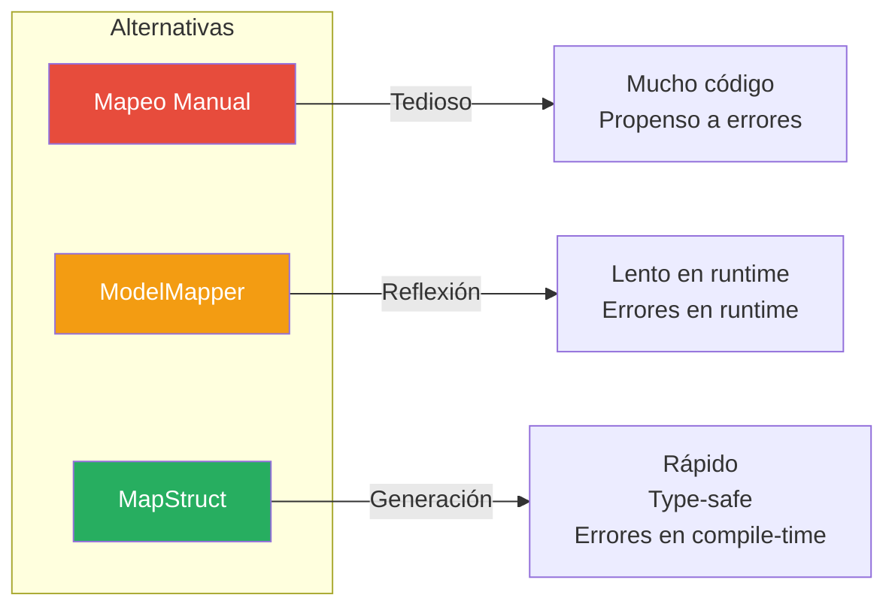
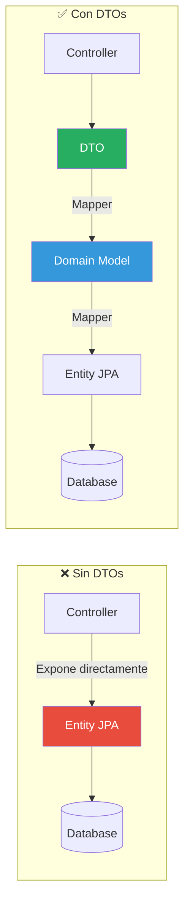

# Patrones y Mejores Prácticas en Spring Boot

> **Serie: Construyendo Microservicios con Spring Boot y Arquitectura Hexagonal**  
> Parte 6 de 7 - Patrones de Diseño y Mejores Prácticas

## 📖 Introducción

En este artículo exploraremos los patrones de diseño y mejores prácticas que hemos aplicado en nuestro proyecto. Estos patrones no solo mejoran la calidad del código, sino que también facilitan el mantenimiento y la evolución del sistema.

**Temas que cubriremos:**
- 🗺️ MapStruct para mapeo eficiente
- 🚨 Manejo global de excepciones
- ✅ Validaciones con Bean Validation
- 📦 DTOs vs Entities
- 📝 Logging estructurado
- 🔄 Respuestas estandarizadas

## 🗺️ MapStruct: Mapeo Eficiente

### ¿Por Qué MapStruct?



### Comparación de Rendimiento

```
Operación              | Manual | ModelMapper | MapStruct
-----------------------|--------|-------------|----------
Mapeo simple (1000x)   | 0.5ms  | 15ms        | 0.6ms
Mapeo complejo (1000x) | 2ms    | 45ms        | 2.5ms
Detección de errores   | Runtime| Runtime     | Compile-time
```

### Implementación Básica

```java
@Mapper(componentModel = "spring")
public interface UserMapper {
    
    // Mapeo simple
    UserDTO toDTO(User user);
    
    // Mapeo con campos ignorados
    @Mapping(target = "id", ignore = true)
    @Mapping(target = "password", ignore = true)
    @Mapping(target = "createdAt", ignore = true)
    User toDomain(RegisterRequest request);
    
    // Mapeo de colecciones
    List<UserDTO> toDTOList(List<User> users);
}
```

### Mapeo Complejo con Expresiones

```java
@Mapper(componentModel = "spring")
public interface ProductMapper {
    
    // Expresión Java para cálculo
    @Mapping(target = "averageRating", 
             expression = "java(product.getAverageRating())")
    @Mapping(target = "reviewCount", 
             expression = "java(product.getReviews() != null ? product.getReviews().size() : 0)")
    ProductDTO toDTO(Product product);
    
    // Mapeo con conversión de tipos
    @Mapping(target = "category", source = "categoryName")
    Product toDomain(CreateProductRequest request);
}
```

### Actualización Parcial

```java
@Mapper(componentModel = "spring")
public interface ProductMapper {
    
    // Solo actualiza campos no nulos
    @BeanMapping(nullValuePropertyMappingStrategy = NullValuePropertyMappingStrategy.IGNORE)
    @Mapping(target = "id", ignore = true)
    @Mapping(target = "createdAt", ignore = true)
    void updateProductFromDto(UpdateProductRequest dto, @MappingTarget Product product);
}
```

**Uso:**

```java
@Service
public class ProductService {
    
    public Product update(String id, UpdateProductRequest request) {
        Product existing = productPort.findById(id)
                .orElseThrow(() -> new ProductNotFoundException(id));
        
        // Solo actualiza campos presentes en el request
        productMapper.updateProductFromDto(request, existing);
        
        return productPort.save(existing);
    }
}
```

### Mapeo con Dependencias

```java
@Mapper(componentModel = "spring", uses = {CategoryMapper.class})
public interface ProductMapper {
    
    // Usa CategoryMapper automáticamente
    ProductDTO toDTO(Product product);
}

@Mapper(componentModel = "spring")
public interface CategoryMapper {
    CategoryDTO toDTO(Category category);
}
```

## 🚨 Manejo Global de Excepciones

### Arquitectura del Manejo de Errores

```mermaid
graph TB
    CTRL[Controller]
    SVC[Service]
    EX1[ProductNotFoundException]
    EX2[UserAlreadyExistsException]
    EX3[ValidationException]
    HANDLER[GlobalExceptionHandler<br/>@RestControllerAdvice]
    RESPONSE[ErrorResponse]
    
    CTRL --> SVC
    SVC -->|throw| EX1
    SVC -->|throw| EX2
    CTRL -->|validation| EX3
    EX1 --> HANDLER
    EX2 --> HANDLER
    EX3 --> HANDLER
    HANDLER --> RESPONSE
    
    style HANDLER fill:#4A90E2,color:#fff
    style RESPONSE fill:#27AE60,color:#fff
```

### GlobalExceptionHandler

```java
@Slf4j
@RestControllerAdvice
public class GlobalExceptionHandler {

    /**
     * Manejo de excepciones de dominio
     */
    @ExceptionHandler(ProductNotFoundException.class)
    public ResponseEntity<ErrorResponse> handleProductNotFound(ProductNotFoundException ex) {
        log.error("Product not found: {}", ex.getMessage());
        
        ErrorResponse error = new ErrorResponse(
            "PRODUCT_NOT_FOUND",
            ex.getMessage(),
            HttpStatus.NOT_FOUND.value()
        );
        
        return ResponseEntity.status(HttpStatus.NOT_FOUND).body(error);
    }

    @ExceptionHandler(UserAlreadyExistsException.class)
    public ResponseEntity<ErrorResponse> handleUserAlreadyExists(UserAlreadyExistsException ex) {
        log.error("User already exists: {}", ex.getMessage());
        
        ErrorResponse error = new ErrorResponse(
            "USER_ALREADY_EXISTS",
            ex.getMessage(),
            HttpStatus.CONFLICT.value()
        );
        
        return ResponseEntity.status(HttpStatus.CONFLICT).body(error);
    }

    /**
     * Manejo de errores de validación
     */
    @ExceptionHandler(MethodArgumentNotValidException.class)
    public ResponseEntity<ErrorResponse> handleValidationErrors(
            MethodArgumentNotValidException ex) {
        
        List<ErrorResponse.FieldError> fieldErrors = ex.getBindingResult()
                .getFieldErrors()
                .stream()
                .map(error -> new ErrorResponse.FieldError(
                    error.getField(),
                    error.getDefaultMessage(),
                    error.getRejectedValue()
                ))
                .collect(Collectors.toList());

        ErrorResponse error = new ErrorResponse(
            "VALIDATION_ERROR",
            "Validation failed",
            HttpStatus.BAD_REQUEST.value(),
            Instant.now(),
            fieldErrors
        );

        return ResponseEntity.badRequest().body(error);
    }

    /**
     * Manejo de errores de autenticación
     */
    @ExceptionHandler(InvalidCredentialsException.class)
    public ResponseEntity<ErrorResponse> handleInvalidCredentials(
            InvalidCredentialsException ex) {
        
        ErrorResponse error = new ErrorResponse(
            "INVALID_CREDENTIALS",
            ex.getMessage(),
            HttpStatus.UNAUTHORIZED.value()
        );
        
        return ResponseEntity.status(HttpStatus.UNAUTHORIZED).body(error);
    }

    /**
     * Manejo de errores de autorización
     */
    @ExceptionHandler(AccessDeniedException.class)
    public ResponseEntity<ErrorResponse> handleAccessDenied(AccessDeniedException ex) {
        log.error("Access denied: {}", ex.getMessage());
        
        ErrorResponse error = new ErrorResponse(
            "ACCESS_DENIED",
            "Access denied",
            HttpStatus.FORBIDDEN.value()
        );
        
        return ResponseEntity.status(HttpStatus.FORBIDDEN).body(error);
    }

    /**
     * Manejo de errores genéricos
     */
    @ExceptionHandler(Exception.class)
    public ResponseEntity<ErrorResponse> handleGenericException(Exception ex) {
        log.error("Unexpected error", ex);
        
        ErrorResponse error = new ErrorResponse(
            "INTERNAL_SERVER_ERROR",
            "An unexpected error occurred",
            HttpStatus.INTERNAL_SERVER_ERROR.value()
        );
        
        return ResponseEntity.status(HttpStatus.INTERNAL_SERVER_ERROR).body(error);
    }
}
```

### ErrorResponse Estandarizado

```java
@Data
@NoArgsConstructor
@AllArgsConstructor
public class ErrorResponse {
    private String errorCode;
    private String message;
    private int status;
    private Instant timestamp;
    private List<FieldError> fieldErrors;

    public ErrorResponse(String errorCode, String message, int status) {
        this.errorCode = errorCode;
        this.message = message;
        this.status = status;
        this.timestamp = Instant.now();
    }

    @Data
    @AllArgsConstructor
    public static class FieldError {
        private String field;
        private String message;
        private Object rejectedValue;
    }
}
```

### Respuesta de Error Ejemplo

```json
{
  "errorCode": "VALIDATION_ERROR",
  "message": "Validation failed",
  "status": 400,
  "timestamp": "2025-11-23T10:00:00Z",
  "fieldErrors": [
    {
      "field": "price",
      "message": "Price must be greater than 0",
      "rejectedValue": -10
    },
    {
      "field": "name",
      "message": "Name is required",
      "rejectedValue": null
    }
  ]
}
```

## ✅ Validaciones con Bean Validation

### Anotaciones Comunes

```java
public record CreateProductRequest(
    @NotBlank(message = "Name is required")
    @Size(min = 3, max = 100, message = "Name must be between 3 and 100 characters")
    String name,

    @Size(max = 500, message = "Description cannot exceed 500 characters")
    String description,

    @NotNull(message = "Price is required")
    @DecimalMin(value = "0.01", message = "Price must be greater than 0")
    @DecimalMax(value = "999999.99", message = "Price cannot exceed 999999.99")
    BigDecimal price,

    @NotNull(message = "Category is required")
    Category category,

    @NotNull(message = "Stock is required")
    @Min(value = 0, message = "Stock cannot be negative")
    @Max(value = 100000, message = "Stock cannot exceed 100000")
    Integer stock,

    @Email(message = "Invalid email format")
    String contactEmail,

    @Pattern(regexp = "^https?://.*", message = "Image URL must be valid HTTP(S) URL")
    List<String> images
) {}
```

### Validaciones Personalizadas

```java
@Target({ElementType.FIELD})
@Retention(RetentionPolicy.RUNTIME)
@Constraint(validatedBy = StrongPasswordValidator.class)
public @interface StrongPassword {
    String message() default "Password must contain at least one uppercase, one lowercase, one digit, and one special character";
    Class<?>[] groups() default {};
    Class<? extends Payload>[] payload() default {};
}

public class StrongPasswordValidator implements ConstraintValidator<StrongPassword, String> {
    
    private static final String PASSWORD_PATTERN = 
        "^(?=.*[a-z])(?=.*[A-Z])(?=.*\\d)(?=.*[@$!%*?&])[A-Za-z\\d@$!%*?&]{8,}$";
    
    @Override
    public boolean isValid(String password, ConstraintValidatorContext context) {
        if (password == null) {
            return false;
        }
        return password.matches(PASSWORD_PATTERN);
    }
}
```

**Uso:**

```java
public record RegisterRequest(
    @NotBlank String username,
    @Email String email,
    @StrongPassword String password,
    Set<Role> roles
) {}
```

### Validación en Controladores

```java
@RestController
@Validated  // Habilita validación de parámetros
public class ProductController {

    @PostMapping
    public ResponseEntity<ApiResponse<ProductDTO>> createProduct(
            @Valid @RequestBody CreateProductRequest request) {  // @Valid activa validación
        // Si hay errores, lanza MethodArgumentNotValidException
        // que es capturada por GlobalExceptionHandler
    }

    @GetMapping("/{id}")
    public ResponseEntity<ApiResponse<ProductDTO>> getProduct(
            @PathVariable @Pattern(regexp = "^[a-f0-9]{24}$", message = "Invalid MongoDB ID") 
            String id) {
        // Valida formato de ObjectId de MongoDB
    }
}
```

## 📦 DTOs vs Entities: Separación de Responsabilidades

### ¿Por Qué Separar?



### Problemas de Exponer Entidades Directamente

```java
// ❌ MAL: Exponer entidad JPA directamente
@Entity
@Table(name = "users")
public class User {
    @Id
    private Long id;
    private String username;
    private String password;  // ⚠️ Expone contraseña!
    
    @OneToMany(mappedBy = "user", fetch = FetchType.LAZY)
    private List<Order> orders;  // ⚠️ Puede causar N+1 queries
}

@GetMapping("/users/{id}")
public User getUser(@PathVariable Long id) {
    return userRepository.findById(id).orElseThrow();
    // ⚠️ Retorna entidad con todos los campos
}
```

**Problemas:**
- ✗ Expone campos sensibles (password)
- ✗ Puede causar lazy loading exceptions
- ✗ Acopla API a estructura de BD
- ✗ Dificulta versionado de API

### Solución: Usar DTOs

```java
// ✅ BIEN: DTO para respuesta
public record UserDTO(
    Long id,
    String username,
    String email,
    Set<Role> roles,
    boolean enabled
    // ✅ No incluye password
    // ✅ No incluye relaciones complejas
) {}

@GetMapping("/users/{id}")
public ResponseEntity<ApiResponse<UserDTO>> getUser(@PathVariable Long id) {
    User user = userService.findById(id);
    UserDTO dto = userMapper.toDTO(user);  // ✅ Mapeo explícito
    return ResponseEntity.ok(ApiResponse.success(dto));
}
```

### Tipos de DTOs

```java
// 1. Request DTO - Entrada de datos
public record CreateProductRequest(
    @NotBlank String name,
    @NotNull BigDecimal price,
    Category category
) {}

// 2. Response DTO - Salida de datos
public record ProductDTO(
    String id,
    String name,
    BigDecimal price,
    Category category,
    Double averageRating,  // Campo calculado
    Instant createdAt
) {}

// 3. Update DTO - Actualización parcial
public record UpdateProductRequest(
    String name,      // Opcional
    BigDecimal price, // Opcional
    Integer stock     // Opcional
) {}

// 4. Summary DTO - Vista resumida
public record ProductSummaryDTO(
    String id,
    String name,
    BigDecimal price
    // Solo campos esenciales para listados
) {}
```

## 📝 Logging Estructurado

### Niveles de Log

```java
@Slf4j
@Service
public class ProductService {

    public Product create(Product product) {
        log.trace("Entering create method with product: {}", product);  // Muy detallado
        log.debug("Creating product: {}", product.getName());           // Debugging
        log.info("Product created successfully: {}", product.getId());  // Info importante
        log.warn("Product stock is low: {}", product.getStock());       // Advertencias
        log.error("Failed to create product", exception);               // Errores
    }
}
```

### Configuración de Logs

```yaml
logging:
  level:
    root: INFO
    com.example.microservices: DEBUG
    org.springframework.web: DEBUG
    org.springframework.security: DEBUG
    org.hibernate.SQL: DEBUG
    org.hibernate.type.descriptor.sql.BasicBinder: TRACE
  
  pattern:
    console: "%d{yyyy-MM-dd HH:mm:ss} - %msg%n"
    file: "%d{yyyy-MM-dd HH:mm:ss} [%thread] %-5level %logger{36} - %msg%n"
  
  file:
    name: logs/application.log
    max-size: 10MB
    max-history: 30
```

### Logging de Requests/Responses

```java
@Slf4j
@Component
public class LoggingFilter extends OncePerRequestFilter {

    @Override
    protected void doFilterInternal(HttpServletRequest request,
                                    HttpServletResponse response,
                                    FilterChain filterChain) throws ServletException, IOException {
        
        long startTime = System.currentTimeMillis();
        
        log.info("Request: {} {} from {}",
                request.getMethod(),
                request.getRequestURI(),
                request.getRemoteAddr());
        
        filterChain.doFilter(request, response);
        
        long duration = System.currentTimeMillis() - startTime;
        
        log.info("Response: {} {} - Status: {} - Duration: {}ms",
                request.getMethod(),
                request.getRequestURI(),
                response.getStatus(),
                duration);
    }
}
```

### Logs Estructurados con MDC

```java
@Component
public class MdcFilter extends OncePerRequestFilter {

    @Override
    protected void doFilterInternal(HttpServletRequest request,
                                    HttpServletResponse response,
                                    FilterChain filterChain) {
        try {
            // Agregar contexto al MDC
            MDC.put("requestId", UUID.randomUUID().toString());
            MDC.put("userId", getCurrentUserId());
            MDC.put("ipAddress", request.getRemoteAddr());
            
            filterChain.doFilter(request, response);
        } finally {
            MDC.clear();  // Limpiar MDC
        }
    }
}
```

**Configuración:**

```xml
<pattern>%d{yyyy-MM-dd HH:mm:ss} [%X{requestId}] [%X{userId}] - %msg%n</pattern>
```

**Output:**

```
2025-11-23 10:00:00 [a1b2c3d4] [admin] - Creating product: Laptop
2025-11-23 10:00:01 [a1b2c3d4] [admin] - Product created successfully
```

## 🔄 Respuestas Estandarizadas

### ApiResponse Genérico

```java
@Data
@NoArgsConstructor
@AllArgsConstructor
public class ApiResponse<T> {
    private String code;
    private String message;
    private T data;
    private Instant timestamp;

    public static <T> ApiResponse<T> success(T data) {
        return new ApiResponse<>(
            "SUCCESS",
            "Request processed successfully",
            data,
            Instant.now()
        );
    }

    public static <T> ApiResponse<T> success(T data, String message) {
        return new ApiResponse<>(
            "SUCCESS",
            message,
            data,
            Instant.now()
        );
    }

    public static <T> ApiResponse<T> error(String code, String message) {
        return new ApiResponse<>(
            code,
            message,
            null,
            Instant.now()
        );
    }
}
```

### Uso Consistente

```java
@RestController
public class ProductController {

    @GetMapping
    public ResponseEntity<ApiResponse<List<ProductDTO>>> getAllProducts() {
        List<ProductDTO> products = productService.findAll();
        return ResponseEntity.ok(ApiResponse.success(products));
    }

    @PostMapping
    public ResponseEntity<ApiResponse<ProductDTO>> createProduct(@RequestBody CreateProductRequest request) {
        ProductDTO product = productService.create(request);
        return ResponseEntity.ok(
            ApiResponse.success(product, "Product created successfully")
        );
    }
}
```

### Respuestas Consistentes

```json
// Éxito
{
  "code": "SUCCESS",
  "message": "Product created successfully",
  "data": {
    "id": "123",
    "name": "Laptop"
  },
  "timestamp": "2025-11-23T10:00:00Z"
}

// Error
{
  "errorCode": "PRODUCT_NOT_FOUND",
  "message": "Product not found with id: 123",
  "status": 404,
  "timestamp": "2025-11-23T10:00:00Z"
}
```

## 🎯 Checklist de Mejores Prácticas

### Código
- [ ] MapStruct para todos los mapeos
- [ ] DTOs separados de entidades
- [ ] Validaciones con Bean Validation
- [ ] Manejo global de excepciones
- [ ] Logging estructurado con niveles apropiados

### Seguridad
- [ ] No exponer entidades JPA directamente
- [ ] Validar todos los inputs
- [ ] Sanitizar datos sensibles en logs
- [ ] HTTPS en producción

### Performance
- [ ] Usar DTOs para evitar lazy loading
- [ ] Proyecciones para queries grandes
- [ ] Paginación en listados
- [ ] Caché cuando sea apropiado

### Mantenibilidad
- [ ] Nombres descriptivos
- [ ] Comentarios en lógica compleja
- [ ] Tests unitarios y de integración
- [ ] Documentación actualizada

## 📚 Próximo Artículo

En **Parte 7: Testing y Deployment**, veremos:
- Tests unitarios con JUnit 5 y Mockito
- Tests de integración con Testcontainers
- Pruebas con Postman
- Deployment con Docker
- CI/CD con GitHub Actions

---

**Serie Completa:**
1. Introducción a la Arquitectura Hexagonal
2. Setup del Proyecto Multi-Módulo
3. Implementación del Auth Service
4. Implementación del Product Service
5. Seguridad con JWT y RSA
6. **Patrones y Mejores Prácticas** ← Estás aquí
7. Testing y Deployment
