# Testing y Deployment: De Desarrollo a Producción

> **Serie: Construyendo Microservicios con Spring Boot y Arquitectura Hexagonal**  
> Parte 7 de 7 - Testing, Deployment y CI/CD

## 📖 Introducción

En este artículo final de la serie, cubriremos cómo probar y desplegar nuestros microservicios. Una aplicación bien testeada y con un proceso de deployment automatizado es fundamental para mantener la calidad y agilidad del desarrollo.

**Temas que cubriremos:**
- 🧪 Tests unitarios con JUnit 5 y Mockito
- 🔗 Tests de integración con Testcontainers
- 📮 Pruebas con Postman
- 🐳 Containerización con Docker
- 🚀 CI/CD con GitHub Actions
- 📊 Monitoreo y observabilidad

## 🧪 Testing: Pirámide de Tests

```mermaid
graph TB
    subgraph "Pirámide de Tests"
        E2E[Tests E2E<br/>Postman/Selenium<br/>Pocos, lentos]
        INT[Tests de Integración<br/>Testcontainers<br/>Moderados]
        UNIT[Tests Unitarios<br/>JUnit + Mockito<br/>Muchos, rápidos]
    end
    
    E2E --> INT
    INT --> UNIT
    
    style E2E fill:#E74C3C,color:#fff
    style INT fill:#F39C12,color:#fff
    style UNIT fill:#27AE60,color:#fff
```



### Distribución Recomendada

- **70%** Tests Unitarios (rápidos, aislados)
- **20%** Tests de Integración (BD, APIs)
- **10%** Tests E2E (flujos completos)

## 🎯 Tests Unitarios

### Configuración de Dependencias

```xml
<dependencies>
    <!-- JUnit 5 -->
    <dependency>
        <groupId>org.springframework.boot</groupId>
        <artifactId>spring-boot-starter-test</artifactId>
        <scope>test</scope>
    </dependency>
    
    <!-- Mockito (incluido en spring-boot-starter-test) -->
    <!-- AssertJ (incluido en spring-boot-starter-test) -->
</dependencies>
```

### Test de Dominio (Sin Dependencias)

```java
class UserTest {

    @Test
    @DisplayName("Should activate user with valid email")
    void shouldActivateUserWithValidEmail() {
        // Given
        User user = new User("john", "john@example.com", "pass123", Set.of(Role.USER));
        
        // When
        user.activate();
        
        // Then
        assertThat(user.isEnabled()).isTrue();
    }

    @Test
    @DisplayName("Should throw exception when activating user without email")
    void shouldThrowExceptionWhenActivatingUserWithoutEmail() {
        // Given
        User user = new User("john", null, "pass123", Set.of(Role.USER));
        
        // When & Then
        assertThatThrownBy(() -> user.activate())
                .isInstanceOf(IllegalStateException.class)
                .hasMessageContaining("Cannot activate user without email");
    }

    @Test
    @DisplayName("Should check if user has specific permission")
    void shouldCheckIfUserHasPermission() {
        // Given
        User user = new User("admin", "admin@example.com", "pass123", Set.of(Role.ADMIN));
        
        // When & Then
        assertThat(user.hasPermission("product:delete")).isTrue();
        assertThat(user.hasPermission("non:existent")).isFalse();
    }
}
```

### Test de Servicio con Mocks

```java
@ExtendWith(MockitoExtension.class)
class AuthServiceTest {

    @Mock
    private UserPort userPort;

    @Mock
    private PasswordEncoder passwordEncoder;

    @Mock
    private JwtTokenProvider jwtTokenProvider;

    @Mock
    private AuthenticationManager authenticationManager;

    @InjectMocks
    private AuthService authService;

    @Test
    @DisplayName("Should register new user successfully")
    void shouldRegisterNewUser() {
        // Given
        User user = new User("john", "john@example.com", "password", Set.of(Role.USER));
        
        when(userPort.existsByUsername("john")).thenReturn(false);
        when(userPort.existsByEmail("john@example.com")).thenReturn(false);
        when(passwordEncoder.encode("password")).thenReturn("encodedPassword");
        when(userPort.save(any(User.class))).thenReturn(user);

        // When
        User result = authService.register(user, "password");

        // Then
        assertThat(result).isNotNull();
        assertThat(result.getUsername()).isEqualTo("john");
        assertThat(result.isEnabled()).isTrue();
        
        verify(userPort).existsByUsername("john");
        verify(userPort).existsByEmail("john@example.com");
        verify(passwordEncoder).encode("password");
        verify(userPort).save(any(User.class));
    }

    @Test
    @DisplayName("Should throw exception when username already exists")
    void shouldThrowExceptionWhenUsernameExists() {
        // Given
        User user = new User("john", "john@example.com", "password", Set.of(Role.USER));
        when(userPort.existsByUsername("john")).thenReturn(true);

        // When & Then
        assertThatThrownBy(() -> authService.register(user, "password"))
                .isInstanceOf(UserAlreadyExistsException.class)
                .hasMessageContaining("username: john");
        
        verify(userPort).existsByUsername("john");
        verify(userPort, never()).save(any());
    }

    @Test
    @DisplayName("Should login user and return JWT token")
    void shouldLoginUserAndReturnToken() {
        // Given
        String username = "john";
        String password = "password";
        String expectedToken = "jwt.token.here";
        
        Authentication authentication = mock(Authentication.class);
        when(authenticationManager.authenticate(any())).thenReturn(authentication);
        when(jwtTokenProvider.generateToken(authentication)).thenReturn(expectedToken);

        // When
        String token = authService.login(username, password);

        // Then
        assertThat(token).isEqualTo(expectedToken);
        verify(authenticationManager).authenticate(any(UsernamePasswordAuthenticationToken.class));
        verify(jwtTokenProvider).generateToken(authentication);
    }
}
```

### Test de Mapper

```java
@SpringBootTest
class UserMapperTest {

    @Autowired
    private UserMapper userMapper;

    @Test
    @DisplayName("Should map User to UserDTO")
    void shouldMapUserToDTO() {
        // Given
        User user = new User(
            1L,
            "john",
            "john@example.com",
            "password",
            Set.of(Role.USER),
            true,
            Instant.now(),
            Instant.now()
        );

        // When
        UserDTO dto = userMapper.toDTO(user);

        // Then
        assertThat(dto).isNotNull();
        assertThat(dto.id()).isEqualTo(1L);
        assertThat(dto.username()).isEqualTo("john");
        assertThat(dto.email()).isEqualTo("john@example.com");
        assertThat(dto.roles()).containsExactly(Role.USER);
        assertThat(dto.enabled()).isTrue();
    }

    @Test
    @DisplayName("Should map RegisterRequest to User domain")
    void shouldMapRegisterRequestToUser() {
        // Given
        RegisterRequest request = new RegisterRequest(
            "john",
            "john@example.com",
            "password",
            Set.of(Role.USER)
        );

        // When
        User user = userMapper.toDomain(request);

        // Then
        assertThat(user).isNotNull();
        assertThat(user.getUsername()).isEqualTo("john");
        assertThat(user.getEmail()).isEqualTo("john@example.com");
        assertThat(user.getRoles()).containsExactly(Role.USER);
        assertThat(user.getId()).isNull();  // Ignorado en mapeo
        assertThat(user.getPassword()).isNull();  // Ignorado en mapeo
    }
}
```

## 🔗 Tests de Integración

### Testcontainers para PostgreSQL

```xml
<dependency>
    <groupId>org.testcontainers</groupId>
    <artifactId>testcontainers</artifactId>
    <version>1.19.3</version>
    <scope>test</scope>
</dependency>
<dependency>
    <groupId>org.testcontainers</groupId>
    <artifactId>postgresql</artifactId>
    <version>1.19.3</version>
    <scope>test</scope>
</dependency>
```

### Base Test Configuration

```java
@SpringBootTest
@Testcontainers
@ActiveProfiles("test")
public abstract class IntegrationTestBase {

    @Container
    static PostgreSQLContainer<?> postgres = new PostgreSQLContainer<>("postgres:16-alpine")
            .withDatabaseName("testdb")
            .withUsername("test")
            .withPassword("test");

    @DynamicPropertySource
    static void configureProperties(DynamicPropertyRegistry registry) {
        registry.add("spring.datasource.url", postgres::getJdbcUrl);
        registry.add("spring.datasource.username", postgres::getUsername);
        registry.add("spring.datasource.password", postgres::getPassword);
    }
}
```

### Test de Repositorio

```java
@DataJpaTest
@AutoConfigureTestDatabase(replace = AutoConfigureTestDatabase.Replace.NONE)
@Testcontainers
class UserJpaRepositoryTest {

    @Container
    static PostgreSQLContainer<?> postgres = new PostgreSQLContainer<>("postgres:16-alpine");

    @DynamicPropertySource
    static void configureProperties(DynamicPropertyRegistry registry) {
        registry.add("spring.datasource.url", postgres::getJdbcUrl);
        registry.add("spring.datasource.username", postgres::getUsername);
        registry.add("spring.datasource.password", postgres::getPassword);
    }

    @Autowired
    private UserJpaRepository repository;

    @Test
    @DisplayName("Should save and find user by username")
    void shouldSaveAndFindUserByUsername() {
        // Given
        UserEntity user = new UserEntity();
        user.setUsername("john");
        user.setEmail("john@example.com");
        user.setPassword("encodedPassword");
        user.setRoles(Set.of(Role.USER));
        user.setEnabled(true);

        // When
        repository.save(user);
        Optional<UserEntity> found = repository.findByUsername("john");

        // Then
        assertThat(found).isPresent();
        assertThat(found.get().getUsername()).isEqualTo("john");
        assertThat(found.get().getEmail()).isEqualTo("john@example.com");
    }

    @Test
    @DisplayName("Should check if username exists")
    void shouldCheckIfUsernameExists() {
        // Given
        UserEntity user = new UserEntity();
        user.setUsername("john");
        user.setEmail("john@example.com");
        user.setPassword("encodedPassword");
        user.setRoles(Set.of(Role.USER));
        user.setEnabled(true);
        repository.save(user);

        // When & Then
        assertThat(repository.existsByUsername("john")).isTrue();
        assertThat(repository.existsByUsername("jane")).isFalse();
    }
}
```

### Test de API (Controller)

```java
@SpringBootTest(webEnvironment = SpringBootTest.WebEnvironment.RANDOM_PORT)
@Testcontainers
@ActiveProfiles("test")
class AuthControllerIntegrationTest extends IntegrationTestBase {

    @LocalServerPort
    private int port;

    @Autowired
    private TestRestTemplate restTemplate;

    @Autowired
    private UserJpaRepository userRepository;

    @Autowired
    private PasswordEncoder passwordEncoder;

    @BeforeEach
    void setUp() {
        userRepository.deleteAll();
    }

    @Test
    @DisplayName("Should register new user")
    void shouldRegisterNewUser() {
        // Given
        RegisterRequest request = new RegisterRequest(
            "john",
            "john@example.com",
            "Password123!",
            Set.of(Role.USER)
        );

        // When
        ResponseEntity<ApiResponse> response = restTemplate.postForEntity(
            "http://localhost:" + port + "/api/auth/register",
            request,
            ApiResponse.class
        );

        // Then
        assertThat(response.getStatusCode()).isEqualTo(HttpStatus.OK);
        assertThat(response.getBody()).isNotNull();
        assertThat(response.getBody().getCode()).isEqualTo("SUCCESS");
        
        // Verify in database
        Optional<UserEntity> saved = userRepository.findByUsername("john");
        assertThat(saved).isPresent();
    }

    @Test
    @DisplayName("Should login and return JWT token")
    void shouldLoginAndReturnToken() {
        // Given - Create user first
        UserEntity user = new UserEntity();
        user.setUsername("john");
        user.setEmail("john@example.com");
        user.setPassword(passwordEncoder.encode("Password123!"));
        user.setRoles(Set.of(Role.USER));
        user.setEnabled(true);
        userRepository.save(user);

        LoginRequest loginRequest = new LoginRequest("john", "Password123!");

        // When
        ResponseEntity<ApiResponse> response = restTemplate.postForEntity(
            "http://localhost:" + port + "/api/auth/login",
            loginRequest,
            ApiResponse.class
        );

        // Then
        assertThat(response.getStatusCode()).isEqualTo(HttpStatus.OK);
        assertThat(response.getBody()).isNotNull();
        assertThat(response.getBody().getCode()).isEqualTo("SUCCESS");
        
        Map<String, Object> data = (Map<String, Object>) response.getBody().getData();
        assertThat(data.get("token")).isNotNull();
        assertThat(data.get("type")).isEqualTo("Bearer");
    }
}
```

## 📮 Pruebas con Postman

### Colección de Postman

Ya tenemos `MicroservicesHexagonal-CompleteAPI_Tests.postman_collection.json` que incluye:

1. **Auth Service Tests**
   - Register USER
   - Register MODERATOR
   - Register ADMIN
   - Login as USER
   - Login as MODERATOR
   - Login as ADMIN
   - Get current user

2. **Product Service Tests**
   - Create product (MODERATOR)
   - Get all products (USER)
   - Get product by ID (USER)
   - Update product (MODERATOR)
   - Delete product (ADMIN only)

### Variables de Entorno

```json
{
  "auth_service_url": "http://localhost:8081",
  "product_service_url": "http://localhost:8082",
  "user_token": "",
  "moderator_token": "",
  "admin_token": ""
}
```

### Test Scripts

```javascript
// En request de Login
pm.test("Status code is 200", function () {
    pm.response.to.have.status(200);
});

pm.test("Response has token", function () {
    var jsonData = pm.response.json();
    pm.expect(jsonData.data.token).to.exist;
    
    // Guardar token en variable de entorno
    pm.environment.set("admin_token", jsonData.data.token);
});

pm.test("Token is valid JWT", function () {
    var token = pm.environment.get("admin_token");
    pm.expect(token).to.match(/^[A-Za-z0-9-_]+\.[A-Za-z0-9-_]+\.[A-Za-z0-9-_]+$/);
});
```

### Newman (CLI Runner)

```bash
# Instalar Newman
npm install -g newman

# Ejecutar colección
newman run MicroservicesHexagonal-CompleteAPI_Tests.postman_collection.json \
  --environment prod.postman_environment.json \
  --reporters cli,html \
  --reporter-html-export newman-report.html
```

## 🐳 Containerización con Docker

### Dockerfile Multi-Stage para Auth Service

```dockerfile
# Stage 1: Build
FROM maven:3.9-eclipse-temurin-21-alpine AS build
WORKDIR /app

# Copiar POMs
COPY pom.xml .
COPY common/pom.xml common/
COPY auth-service/pom.xml auth-service/

# Descargar dependencias
RUN mvn dependency:go-offline -B

# Copiar código fuente
COPY common/src common/src
COPY auth-service/src auth-service/src

# Compilar
RUN mvn clean package -DskipTests -pl auth-service -am

# Stage 2: Runtime
FROM eclipse-temurin:21-jre-alpine
WORKDIR /app

# Crear usuario no-root
RUN addgroup -S spring && adduser -S spring -G spring
USER spring:spring

# Copiar JAR desde build stage
COPY --from=build /app/auth-service/target/*.jar app.jar

# Copiar claves RSA
COPY --from=build /app/auth-service/src/main/resources/certs /app/certs

# Exponer puerto
EXPOSE 8081

# Health check
HEALTHCHECK --interval=30s --timeout=3s --start-period=40s --retries=3 \
  CMD wget --no-verbose --tries=1 --spider http://localhost:8081/actuator/health || exit 1

# Ejecutar aplicación
ENTRYPOINT ["java", "-jar", "app.jar"]
```

### Dockerfile para Product Service

```dockerfile
FROM maven:3.9-eclipse-temurin-21-alpine AS build
WORKDIR /app

COPY pom.xml .
COPY common/pom.xml common/
COPY product-service/pom.xml product-service/

RUN mvn dependency:go-offline -B

COPY common/src common/src
COPY product-service/src product-service/src

RUN mvn clean package -DskipTests -pl product-service -am

FROM eclipse-temurin:21-jre-alpine
WORKDIR /app

RUN addgroup -S spring && adduser -S spring -G spring
USER spring:spring

COPY --from=build /app/product-service/target/*.jar app.jar
COPY --from=build /app/product-service/src/main/resources/certs /app/certs

EXPOSE 8082

HEALTHCHECK --interval=30s --timeout=3s --start-period=40s --retries=3 \
  CMD wget --no-verbose --tries=1 --spider http://localhost:8082/actuator/health || exit 1

ENTRYPOINT ["java", "-jar", "app.jar"]
```

### Docker Compose Completo

```yaml
version: '3.8'

services:
  # Infrastructure
  postgres:
    image: postgres:16-alpine
    container_name: microservices-postgres
    environment:
      POSTGRES_DB: authdb
      POSTGRES_USER: admin
      POSTGRES_PASSWORD: admin123
    ports:
      - "5432:5432"
    volumes:
      - postgres_data:/var/lib/postgresql/data
    networks:
      - microservices-network
    healthcheck:
      test: ["CMD-SHELL", "pg_isready -U admin"]
      interval: 10s
      timeout: 5s
      retries: 5

  mongodb:
    image: mongo:7
    container_name: microservices-mongodb
    environment:
      MONGO_INITDB_ROOT_USERNAME: admin
      MONGO_INITDB_ROOT_PASSWORD: admin123
    ports:
      - "27017:27017"
    volumes:
      - mongodb_data:/data/db
    networks:
      - microservices-network
    healthcheck:
      test: echo 'db.runCommand("ping").ok' | mongosh localhost:27017/test --quiet
      interval: 10s
      timeout: 5s
      retries: 5

  # Microservices
  auth-service:
    build:
      context: .
      dockerfile: auth-service/Dockerfile
    container_name: auth-service
    environment:
      SPRING_PROFILES_ACTIVE: prod
      SPRING_DATASOURCE_URL: jdbc:postgresql://postgres:5432/authdb
      SPRING_DATASOURCE_USERNAME: admin
      SPRING_DATASOURCE_PASSWORD: admin123
    ports:
      - "8081:8081"
    depends_on:
      postgres:
        condition: service_healthy
    networks:
      - microservices-network
    restart: unless-stopped

  product-service:
    build:
      context: .
      dockerfile: product-service/Dockerfile
    container_name: product-service
    environment:
      SPRING_PROFILES_ACTIVE: prod
      SPRING_DATA_MONGODB_HOST: mongodb
      SPRING_DATA_MONGODB_PORT: 27017
      SPRING_DATA_MONGODB_DATABASE: productdb
      SPRING_DATA_MONGODB_USERNAME: admin
      SPRING_DATA_MONGODB_PASSWORD: admin123
    ports:
      - "8082:8082"
    depends_on:
      mongodb:
        condition: service_healthy
      auth-service:
        condition: service_started
    networks:
      - microservices-network
    restart: unless-stopped

volumes:
  postgres_data:
  mongodb_data:

networks:
  microservices-network:
    driver: bridge
```

### Comandos Docker

```bash
# Construir imágenes
docker-compose build

# Iniciar servicios
docker-compose up -d

# Ver logs
docker-compose logs -f auth-service
docker-compose logs -f product-service

# Detener servicios
docker-compose down

# Detener y eliminar volúmenes
docker-compose down -v
```

## 🚀 CI/CD con GitHub Actions

### .github/workflows/ci-cd.yml

```yaml
name: CI/CD Pipeline

on:
  push:
    branches: [ main, develop ]
  pull_request:
    branches: [ main ]

jobs:
  test:
    name: Run Tests
    runs-on: ubuntu-latest

    services:
      postgres:
        image: postgres:16-alpine
        env:
          POSTGRES_DB: testdb
          POSTGRES_USER: test
          POSTGRES_PASSWORD: test
        ports:
          - 5432:5432
        options: >-
          --health-cmd pg_isready
          --health-interval 10s
          --health-timeout 5s
          --health-retries 5

      mongodb:
        image: mongo:7
        env:
          MONGO_INITDB_ROOT_USERNAME: test
          MONGO_INITDB_ROOT_PASSWORD: test
        ports:
          - 27017:27017

    steps:
      - name: Checkout code
        uses: actions/checkout@v4

      - name: Set up JDK 21
        uses: actions/setup-java@v4
        with:
          java-version: '21'
          distribution: 'temurin'
          cache: maven

      - name: Generate RSA Keys
        run: |
          cd auth-service
          mvn compile exec:java -Dexec.mainClass="com.example.microservices.auth.infrastructure.util.KeyGenerator"
          cp src/main/resources/certs/public_key.pem ../product-service/src/main/resources/certs/

      - name: Run tests
        run: mvn clean test

      - name: Generate test report
        if: always()
        uses: dorny/test-reporter@v1
        with:
          name: Maven Tests
          path: '**/target/surefire-reports/*.xml'
          reporter: java-junit

  build:
    name: Build and Push Docker Images
    needs: test
    runs-on: ubuntu-latest
    if: github.ref == 'refs/heads/main'

    steps:
      - name: Checkout code
        uses: actions/checkout@v4

      - name: Set up Docker Buildx
        uses: docker/setup-buildx-action@v3

      - name: Login to Docker Hub
        uses: docker/login-action@v3
        with:
          username: ${{ secrets.DOCKER_USERNAME }}
          password: ${{ secrets.DOCKER_PASSWORD }}

      - name: Build and push auth-service
        uses: docker/build-push-action@v5
        with:
          context: .
          file: ./auth-service/Dockerfile
          push: true
          tags: |
            ${{ secrets.DOCKER_USERNAME }}/auth-service:latest
            ${{ secrets.DOCKER_USERNAME }}/auth-service:${{ github.sha }}
          cache-from: type=registry,ref=${{ secrets.DOCKER_USERNAME }}/auth-service:buildcache
          cache-to: type=registry,ref=${{ secrets.DOCKER_USERNAME }}/auth-service:buildcache,mode=max

      - name: Build and push product-service
        uses: docker/build-push-action@v5
        with:
          context: .
          file: ./product-service/Dockerfile
          push: true
          tags: |
            ${{ secrets.DOCKER_USERNAME }}/product-service:latest
            ${{ secrets.DOCKER_USERNAME }}/product-service:${{ github.sha }}
          cache-from: type=registry,ref=${{ secrets.DOCKER_USERNAME }}/product-service:buildcache
          cache-to: type=registry,ref=${{ secrets.DOCKER_USERNAME }}/product-service:buildcache,mode=max

  deploy:
    name: Deploy to Production
    needs: build
    runs-on: ubuntu-latest
    if: github.ref == 'refs/heads/main'

    steps:
      - name: Deploy to server
        uses: appleboy/ssh-action@v1.0.0
        with:
          host: ${{ secrets.SERVER_HOST }}
          username: ${{ secrets.SERVER_USER }}
          key: ${{ secrets.SERVER_SSH_KEY }}
          script: |
            cd /opt/microservices
            docker-compose pull
            docker-compose up -d
            docker-compose ps
```

## 📊 Monitoreo y Observabilidad

### Spring Boot Actuator

```xml
<dependency>
    <groupId>org.springframework.boot</groupId>
    <artifactId>spring-boot-starter-actuator</artifactId>
</dependency>
```

```yaml
management:
  endpoints:
    web:
      exposure:
        include: health,info,metrics,prometheus
  endpoint:
    health:
      show-details: always
  metrics:
    export:
      prometheus:
        enabled: true
```

### Endpoints de Monitoreo

```bash
# Health check
curl http://localhost:8081/actuator/health

# Métricas
curl http://localhost:8081/actuator/metrics

# Info de la aplicación
curl http://localhost:8081/actuator/info
```

### Prometheus + Grafana (Opcional)

```yaml
# docker-compose.yml
  prometheus:
    image: prom/prometheus:latest
    volumes:
      - ./prometheus.yml:/etc/prometheus/prometheus.yml
    ports:
      - "9090:9090"

  grafana:
    image: grafana/grafana:latest
    ports:
      - "3000:3000"
    environment:
      - GF_SECURITY_ADMIN_PASSWORD=admin
```

## ✅ Checklist de Deployment

### Pre-Deployment
- [ ] Todos los tests pasan
- [ ] Claves RSA generadas
- [ ] Variables de entorno configuradas
- [ ] Base de datos migrada
- [ ] Logs configurados

### Deployment
- [ ] Docker images construidas
- [ ] Health checks funcionando
- [ ] Servicios accesibles
- [ ] JWT funcionando entre servicios

### Post-Deployment
- [ ] Smoke tests ejecutados
- [ ] Monitoreo activo
- [ ] Logs revisados
- [ ] Backup configurado

## 🎯 Resumen de la Serie

A lo largo de esta serie de 7 artículos, hemos construido un sistema completo de microservicios con:

1. **Arquitectura Hexagonal** - Código mantenible y testeable
2. **Maven Multi-Módulo** - Proyecto bien estructurado
3. **Auth Service** - Autenticación con JWT y RSA
4. **Product Service** - CRUD con MongoDB
5. **Seguridad Robusta** - JWT, RBAC, validaciones
6. **Mejores Prácticas** - MapStruct, DTOs, logging
7. **Testing y CI/CD** - Automatización completa

## 📚 Recursos Adicionales

- [Spring Boot Documentation](https://spring.io/projects/spring-boot)
- [Hexagonal Architecture](https://alistair.cockburn.us/hexagonal-architecture/)
- [Testcontainers](https://www.testcontainers.org/)
- [Docker Best Practices](https://docs.docker.com/develop/dev-best-practices/)
- [GitHub Actions](https://docs.github.com/en/actions)

---

**¡Felicidades!** Has completado la serie completa de Microservicios con Arquitectura Hexagonal.

**Serie Completa:**
1. Introducción a la Arquitectura Hexagonal
2. Setup del Proyecto Multi-Módulo
3. Implementación del Auth Service
4. Implementación del Product Service
5. Seguridad con JWT y RSA
6. Patrones y Mejores Prácticas
7. **Testing y Deployment** ← Estás aquí

---

**¿Siguiente paso?** Implementa estas técnicas en tus propios proyectos y comparte tu experiencia con la comunidad.
